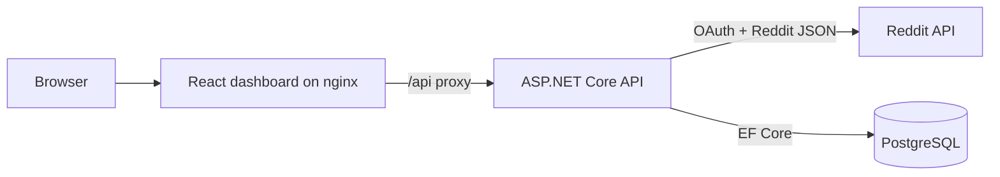
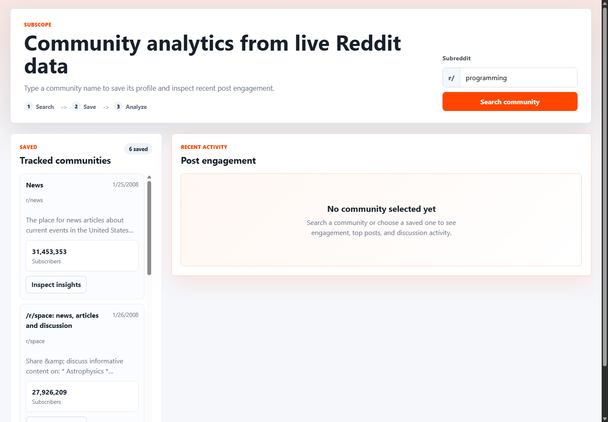

# SubScope

SubScope is a full-stack portfolio dashboard for exploring Reddit community health and recent post engagement. It combines a React + TypeScript frontend, an ASP.NET Core API, PostgreSQL persistence, Reddit OAuth, Docker Compose, and CI build validation.

SubScope is an independent project using Reddit's public API. It is not affiliated with, endorsed by, or sponsored by Reddit.

## Features

- Search a Reddit community and fetch live metadata.
- Persist community profile data in PostgreSQL.
- Reload and display saved communities after refresh.
- Compute recent post analytics from Reddit's `/hot` listing.
- Display posts analyzed, average score, average comments, engagement per subscriber, and top posts.
- Verify service health with an API/database health endpoint.

## Tech Stack

- **Frontend:** React, TypeScript, Vite, nginx
- **Backend:** ASP.NET Core Web API, .NET 8, EF Core
- **Database:** PostgreSQL
- **External API:** Reddit OAuth API
- **DevOps:** Docker Compose, GitHub Actions

## Architecture



## Screenshot



## Project Structure

- `frontend/` - React + TypeScript dashboard served by nginx in Docker
- `backend/` - ASP.NET Core Web API service
- `database/` - PostgreSQL initialization script
- `docs/api.md` - API contract for existing endpoints
- `docs/architecture.md` - runtime architecture and request flow
- `docker-compose.yml` - Docker Compose definitions for local development
- `.github/workflows/` - CI workflow for build validation

## Local Development

1. Copy `.env.example` to a new `.env` file in the repository root, next to `docker-compose.yml`.
2. Fill in `REDDIT_CLIENT_ID` and `REDDIT_CLIENT_SECRET`.
3. Start the stack:

   ```powershell
   docker compose up -d --build
   ```

4. Open the frontend at `http://localhost:3000`.

Local service URLs:

- Frontend: `http://localhost:3000`
- Backend API: `http://localhost:5000`
- PostgreSQL: `localhost:5432`

## Reddit OAuth Setup

The backend uses Reddit OAuth credentials to call `https://oauth.reddit.com`.

1. Create an app at `https://www.reddit.com/prefs/apps`.
2. Choose `script` or `web app` and keep the `client_id` and `client_secret`.
3. Set environment variables in the root `.env` file before running Docker Compose:

   - `REDDIT_CLIENT_ID`
   - `REDDIT_CLIENT_SECRET`

4. Docker Compose reads the root `.env` file and passes the values to the backend container.

Do not commit your Reddit client secret into source control.

## Verification

Build the backend:

```powershell
dotnet build backend/src/RedditAnalytics.Api/RedditAnalytics.Api.csproj
```

Build the frontend Docker image:

```powershell
docker compose build frontend
```

Start all services:

```powershell
docker compose up -d --build
```

Check API health:

```powershell
Invoke-RestMethod -Uri 'http://localhost:3000/api/health'
```

Smoke test subreddit analytics after saving a subreddit:

```powershell
Invoke-RestMethod -Uri 'http://localhost:3000/api/subreddit' -Method Post -ContentType 'application/json' -Body '{"subredditName":"r/dotnet"}'
Invoke-RestMethod -Uri 'http://localhost:3000/api/subreddit/dotnet/analytics'
```

## API Documentation

See [docs/api.md](docs/api.md) for endpoint contracts, example payloads, and error response shape.

## What This Demonstrates

- Full-stack application development with React, TypeScript, ASP.NET Core, and PostgreSQL
- Dockerized local development with service readiness checks
- OAuth-backed integration with a third-party API
- Backend analytics computation over live external data
- Recruiter-friendly documentation and CI build validation
