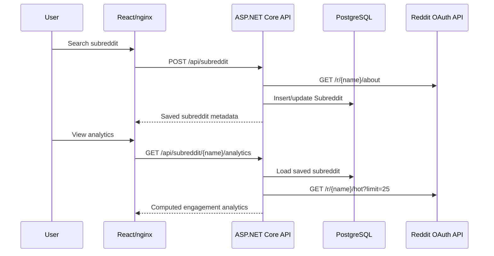

# Architecture

SubScope is a small full-stack analytics dashboard built around a Dockerized local development workflow. It analyzes Reddit communities using Reddit's public API, but it is an independent project and not an official Reddit product.

## Runtime Components

- **Frontend:** React + TypeScript built with Vite and served by nginx.
- **Backend:** ASP.NET Core Web API on .NET 8.
- **Database:** PostgreSQL, accessed through EF Core.
- **External API:** Reddit OAuth API.
- **Orchestration:** Docker Compose starts Postgres, backend, and frontend.

## Request Flow

## Current Capabilities

- Search and persist subreddit metadata.
- Reload saved subreddit records from PostgreSQL.
- Compute live recent-post analytics from Reddit `/hot` data.
- Report API/database health through `/api/health`.
- Build backend and frontend in CI.

## Persistence

The current persisted table is `Subreddits`. Recent Reddit posts are fetched live for analytics and are not persisted yet.

Historical snapshots, post storage, pagination, authentication, and deeper analytics are intentionally out of scope for the current polish milestone.
