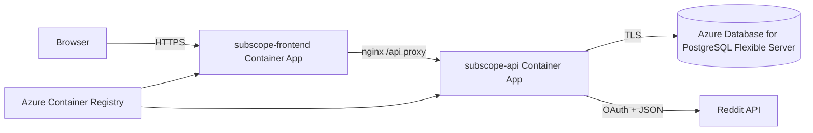

# Manual Azure Deployment

This guide prepares SubScope for a first manual Azure deployment. It intentionally does not add GitHub Actions deployment, Kubernetes, Redis, authentication, or background infrastructure beyond the existing ASP.NET Core worker.

## Proposed Architecture

Use separate Azure Container Apps for the frontend and backend.



Recommended shape:

- `subscope-frontend`: public ingress, serves the React static build through nginx.
- `subscope-api`: internal ingress only, receives traffic from the frontend nginx proxy.
- Azure Database for PostgreSQL Flexible Server: managed PostgreSQL outside the Container Apps environment.
- Azure Container Registry: stores the built frontend and backend images.
- Log Analytics workspace: receives Container Apps logs.

Why not one production container:

- Keeping frontend and backend separate matches the current source ownership and Dockerfiles.
- The backend can scale and restart independently from the static frontend.
- The backend can remain private while the frontend is public.
- The frontend keeps same-origin browser calls by proxying `/api` through nginx.

## Azure Resources

Use globally unique names where Azure requires them.

| Resource | Suggested name | SKU / setting | Purpose |
| --- | --- | --- | --- |
| Resource group | `rg-subscope-prod` | n/a | Groups all resources. |
| Azure Container Registry | `acrsubscope<unique>` | Basic | Stores app images. |
| Log Analytics workspace | `law-subscope-prod` | Pay-as-you-go | Container App logs. |
| Container Apps Environment | `cae-subscope-prod` | Consumption | Hosts both Container Apps. |
| PostgreSQL Flexible Server | `psql-subscope-<unique>` | Burstable `Standard_B1ms` | Persistent app database. |
| PostgreSQL database | `subscope` | n/a | App schema and data. |
| Backend Container App | `subscope-api` | Consumption, 0.25 vCPU / 0.5 GiB, min 1 | API plus background snapshot refresh. |
| Frontend Container App | `subscope-frontend` | Consumption, 0.25 vCPU / 0.5 GiB, min 0 | Public React/nginx app. |

Set the backend minimum replica count to `1` if automatic snapshot collection must run on schedule. If cost matters more than background snapshots, set it to `0`; the API will scale to zero, but the background worker will not run while the app is stopped.

## Required Secrets And Settings

Do not commit these values. Store them as Azure Container App secrets.

Backend secrets:

- `ConnectionStrings__Default`
- `RedditSettings__ClientId`
- `RedditSettings__ClientSecret`

Backend non-secret settings:

- `ASPNETCORE_ENVIRONMENT=Production`
- `ASPNETCORE_URLS=http://+:80`
- `SnapshotRefresh__IntervalMinutes=15`

Frontend settings:

- `API_PROXY_PASS` set to the backend app's internal URL, for example `https://subscope-api.<container-apps-environment-domain>`.
- `API_PROXY_HOST` set to the backend internal FQDN without the scheme, for example `subscope-api.<container-apps-environment-domain>`.

Container registry credentials:

- The first manual CLI path below uses ACR admin credentials so the deployment commands are self-contained.
- After the first deployment, prefer disabling ACR admin credentials and switching Container Apps image pulls to managed identity with `AcrPull`.

Recommended PostgreSQL connection string shape:

```text
Host=<postgres-server>.postgres.database.azure.com;Port=5432;Database=subscope;Username=<admin-user>;Password=<admin-password>;Ssl Mode=Require
```

## Database Schema Strategy

Production should use EF Core migrations, not `database/init.sql` and not startup `EnsureCreated()`.

The API skips `EnsureCreated()` when `ASPNETCORE_ENVIRONMENT=Production`. Apply migrations manually before sending production traffic to the backend.

Initial migration command:

```powershell
dotnet tool restore
dotnet ef database update `
  --project backend/src/RedditAnalytics.Api/RedditAnalytics.Api.csproj `
  --startup-project backend/src/RedditAnalytics.Api/RedditAnalytics.Api.csproj `
  --connection "<AZURE_POSTGRES_CONNECTION_STRING>"
```

`database/init.sql` remains local-development-only for Docker Compose.

## Build And Publish Images

Sign in first:

```powershell
az login
az account set --subscription "<SUBSCRIPTION_ID_OR_NAME>"
```

Create resource group:

```powershell
az group create `
  --name rg-subscope-prod `
  --location eastus
```

Create Azure Container Registry:

```powershell
az acr create `
  --resource-group rg-subscope-prod `
  --name acrsubscope<unique> `
  --sku Basic `
  --admin-enabled true
```

Build images in ACR:

```powershell
az acr build `
  --registry acrsubscope<unique> `
  --image subscope-api:v1 `
  --file backend/src/Dockerfile `
  backend/src

az acr build `
  --registry acrsubscope<unique> `
  --image subscope-frontend:v1 `
  --file frontend/Dockerfile `
  frontend
```

## Create PostgreSQL

Create a low-cost flexible server and database:

```powershell
az postgres flexible-server create `
  --resource-group rg-subscope-prod `
  --name psql-subscope-<unique> `
  --location eastus `
  --tier Burstable `
  --sku-name Standard_B1ms `
  --storage-size 32 `
  --version 17 `
  --admin-user subscopeadmin `
  --admin-password "<STRONG_PASSWORD>" `
  --public-access 0.0.0.0

az postgres flexible-server db create `
  --resource-group rg-subscope-prod `
  --server-name psql-subscope-<unique> `
  --database-name subscope
```

The `--public-access 0.0.0.0` option allows Azure services to connect. For a stricter production deployment, place Container Apps and PostgreSQL on private networking instead, but that is intentionally outside this first manual low-cost deployment slice.

Apply EF migrations:

```powershell
$env:AZURE_POSTGRES_CONNECTION_STRING = "Host=psql-subscope-<unique>.postgres.database.azure.com;Port=5432;Database=subscope;Username=subscopeadmin;Password=<STRONG_PASSWORD>;Ssl Mode=Require"

dotnet tool restore
dotnet ef database update `
  --project backend/src/RedditAnalytics.Api/RedditAnalytics.Api.csproj `
  --startup-project backend/src/RedditAnalytics.Api/RedditAnalytics.Api.csproj `
  --connection $env:AZURE_POSTGRES_CONNECTION_STRING
```

## Create Container Apps

Create the environment:

```powershell
az monitor log-analytics workspace create `
  --resource-group rg-subscope-prod `
  --workspace-name law-subscope-prod `
  --location eastus

$workspaceId = az monitor log-analytics workspace show `
  --resource-group rg-subscope-prod `
  --workspace-name law-subscope-prod `
  --query customerId `
  --output tsv

$workspaceKey = az monitor log-analytics workspace get-shared-keys `
  --resource-group rg-subscope-prod `
  --workspace-name law-subscope-prod `
  --query primarySharedKey `
  --output tsv

az containerapp env create `
  --resource-group rg-subscope-prod `
  --name cae-subscope-prod `
  --location eastus `
  --logs-workspace-id $workspaceId `
  --logs-workspace-key $workspaceKey
```

Grant Container Apps access to ACR:

```powershell
$acrUsername = az acr credential show `
  --resource-group rg-subscope-prod `
  --name acrsubscope<unique> `
  --query username `
  --output tsv

$acrPassword = az acr credential show `
  --resource-group rg-subscope-prod `
  --name acrsubscope<unique> `
  --query passwords[0].value `
  --output tsv
```

Create backend with internal ingress:

```powershell
az containerapp create `
  --resource-group rg-subscope-prod `
  --name subscope-api `
  --environment cae-subscope-prod `
  --image acrsubscope<unique>.azurecr.io/subscope-api:v1 `
  --target-port 80 `
  --ingress internal `
  --registry-server acrsubscope<unique>.azurecr.io `
  --registry-username $acrUsername `
  --registry-password $acrPassword `
  --min-replicas 1 `
  --max-replicas 1 `
  --cpu 0.25 `
  --memory 0.5Gi `
  --secrets `
    db-connection="<AZURE_POSTGRES_CONNECTION_STRING>" `
    reddit-client-id="<REDDIT_CLIENT_ID>" `
    reddit-client-secret="<REDDIT_CLIENT_SECRET>" `
  --env-vars `
    ASPNETCORE_ENVIRONMENT=Production `
    ASPNETCORE_URLS=http://+:80 `
    SnapshotRefresh__IntervalMinutes=15 `
    ConnectionStrings__Default=secretref:db-connection `
    RedditSettings__ClientId=secretref:reddit-client-id `
    RedditSettings__ClientSecret=secretref:reddit-client-secret
```

Get the backend internal URL:

```powershell
$backendFqdn = az containerapp show `
  --resource-group rg-subscope-prod `
  --name subscope-api `
  --query properties.configuration.ingress.fqdn `
  --output tsv
```

Create frontend with public ingress:

```powershell
az containerapp create `
  --resource-group rg-subscope-prod `
  --name subscope-frontend `
  --environment cae-subscope-prod `
  --image acrsubscope<unique>.azurecr.io/subscope-frontend:v1 `
  --target-port 80 `
  --ingress external `
  --registry-server acrsubscope<unique>.azurecr.io `
  --registry-username $acrUsername `
  --registry-password $acrPassword `
  --min-replicas 0 `
  --max-replicas 1 `
  --cpu 0.25 `
  --memory 0.5Gi `
  --env-vars API_PROXY_PASS="https://$backendFqdn" API_PROXY_HOST="$backendFqdn"
```

## Health Checks

Container Apps can probe:

- Backend readiness/liveness path: `/api/health`
- Frontend readiness/liveness path: `/`

After deployment:

```powershell
$frontendUrl = az containerapp show `
  --resource-group rg-subscope-prod `
  --name subscope-frontend `
  --query properties.configuration.ingress.fqdn `
  --output tsv

Invoke-RestMethod "https://$frontendUrl/api/health"
```

The response should report `Healthy` and `Connected`.

## Cost Estimate

For a small portfolio deployment in East US:

| Resource | Monthly estimate |
| --- | ---: |
| Container Apps Consumption, low traffic | `$0-$8` |
| PostgreSQL Flexible Server `Standard_B1ms` compute | about `$12.41` |
| PostgreSQL storage/backups, 32 GiB | about `$4-$6` |
| Azure Container Registry Basic | about `$5` |
| Log Analytics, light ingestion | about `$0-$2` |
| Total expected range | about `$21-$33/month` |

The database is the main always-on cost. Azure free accounts may include PostgreSQL Flexible Server free usage for the first 12 months, depending on account eligibility.

## Steps That Require Sign-In Or Charges

These commands require Azure sign-in:

- `az login`
- `az account set`

These commands create billable resources or can incur charges:

- `az group create`
- `az acr create`
- `az acr build`
- `az postgres flexible-server create`
- `az postgres flexible-server db create`
- `az monitor log-analytics workspace create`
- `az containerapp env create`
- `az containerapp create`

Do not run the deployment commands until you are ready to create Azure resources.
